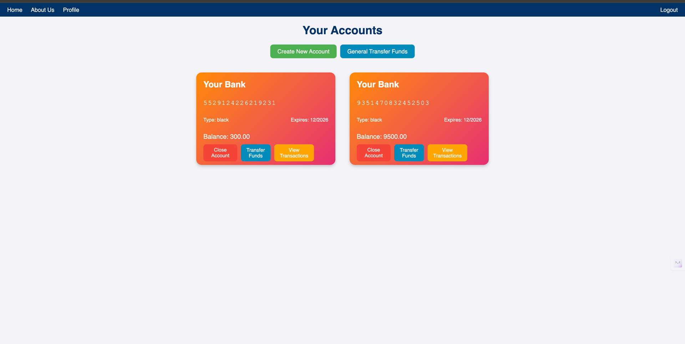
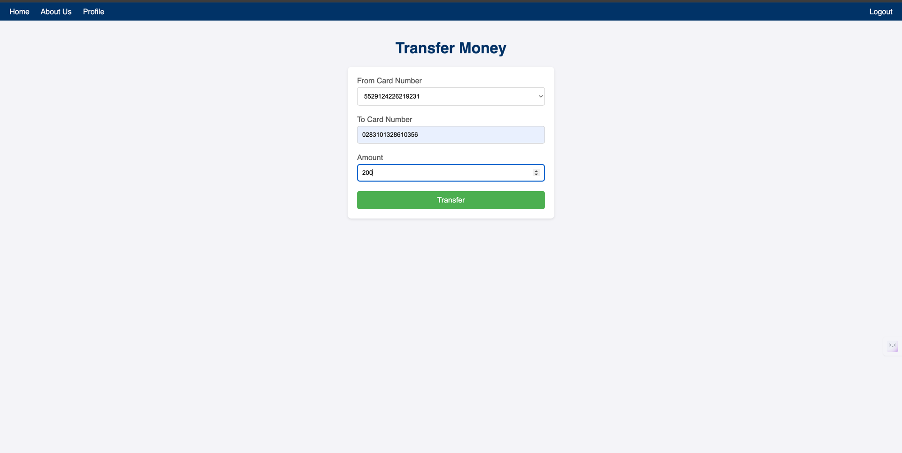
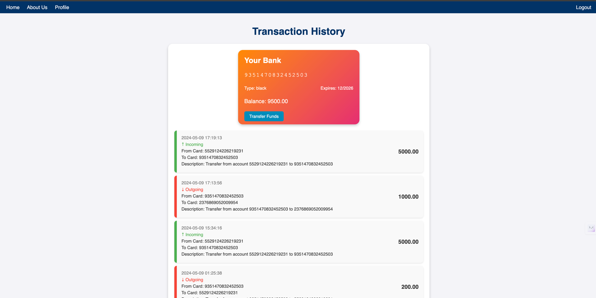

# Release Notes

## Version: 1.0 (07.05)
### Первая версия проекта

### Баги:
- При удалении счета удалялись все связанные транзакции.

------------------------------------------------------ 

# Release Notes

## Version: 1.1

### Добавления:
1. **Кнопка "General Transfer Funds"**:
    - Добавлена кнопка для общего перевода денег, позволяющая пользователям выполнять перевод без привязки к конкретной карте.

2. **Две возможности перевода**:
    - Перевод с карты с сохранением счёта отправителя.
    - Перевод со счёта пользователя, который можно выбрать в drop-down меню.

3. **Поле `AccountStatus` в `Account`**:
    - Добавлено поле `AccountStatus`, позволяющее управлять статусами счетов (например, `ACTIVE`, `CLOSED`).
    - Теперь при закрытии счёта он помечается как `CLOSED`, а не удаляется из базы данных.
    - На странице отображаются только активные счета.

### Обновления:
1. **Контроллер `AccountController`**:
    - Метод `listAccounts` теперь использует `findAllByUserAndStatus` для отображения только активных счетов.

2. **Сервис `AccountService`**:
    - Метод `findAllAccountsByEmail` фильтрует счета по статусу `ACTIVE`.
    - Метод `closeAccount` теперь меняет статус счета на `CLOSED` вместо полного удаления.

3. **Репозиторий `AccountRepository`**:
    - Добавлен метод `findAllByUserAndStatus` для фильтрации счетов по статусу.

## Version: 1.2

### Добавления:
1. **Сущность счёт**:
   - Добавлена новые поля: Номер карты, срок действия карты, cvv код
   - При создании карты, номер карты и код Генерируется рандомно. Для этого написан специальный класс CardNumberGenerator
   - Карты в профиле пользователя теперь отображаются по-другому.

2. **Перевод денег**:
   - Перевод денег происходит по номеру карты.

3. **Отображение транзакций**:
   - Изменена страница отображение транзакций.
   - теперь отображается карта на странице истории транзакции.
   - Каждая транзакция помечается как исходящая или входящяя 
   - Транзакции сортируются по дате
   

   

